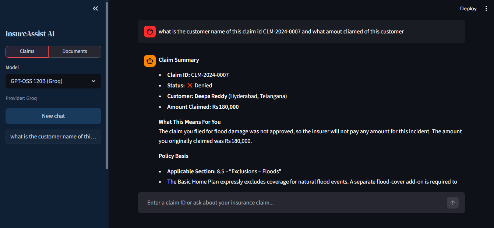
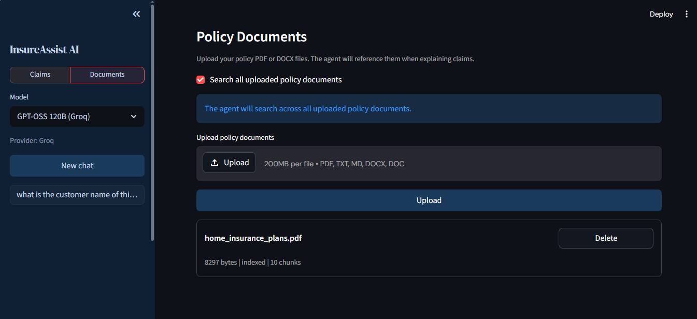

# InsureAssist AI

A GenAI agent that explains insurance claims in plain language using LangChain, Groq, Tavily, ChromaDB RAG, and Streamlit.

## Demo Screentshort




## Setup

### 1. Install dependencies
```bash
pip install -r requirements.txt
```

### 2. Configure environment
```bash
cp .env.example .env
```
Edit `.env` and add your keys:
- `GROQ_API_KEY` — from https://console.groq.com
- `TAVILY_API_KEY` — from https://tavily.com

### 3. Start the backend (terminal 1)
```bash
python main.py
```

### 4. Start the frontend (terminal 2)
```bash
streamlit run app.py
```

Open http://localhost:8501

## Sample Claim IDs to Try

| Claim ID | Type | Status |
|---|---|---|
| CLM-2024-0001 | Health - Hospitalization | Approved |
| CLM-2024-0002 | Health - Outpatient (OON) | Denied |
| CLM-2024-0003 | Health - Prescription | Partial |
| CLM-2024-0004 | Auto - Collision | Approved |
| CLM-2024-0005 | Auto - Theft | Denied (lapse) |
| CLM-2024-0006 | Home - Fire | Approved |
| CLM-2024-0007 | Home - Flood | Denied (exclusion) |
| CLM-2024-0008 | Health - Surgery | Pending |

## File Structure

```
app.py          Streamlit UI
main.py         FastAPI backend
agent.py        LangChain ReAct agent + tools
rag.py          ChromaDB RAG pipeline (PDF/DOCX)
data.py         Synthetic claim records
requirements.txt
.env.example
```

## Usage

1. Go to the **Claims** tab and type a question like:
   - `Explain claim CLM-2024-0002`
   - `Why was CLM-2024-0007 denied and can I appeal?`

2. Go to **Documents** tab to upload your own policy PDFs.
   The agent will reference them when answering policy questions.

3. Multi-turn chat is supported — ask follow-up questions naturally.
