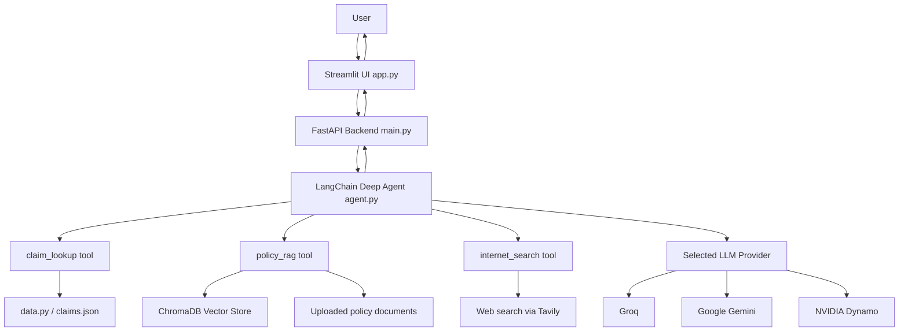
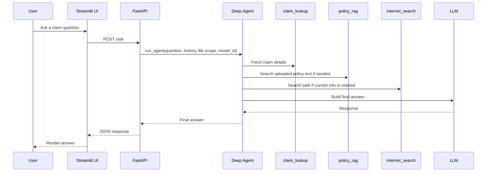
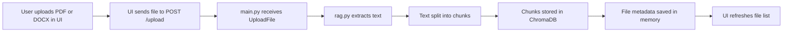
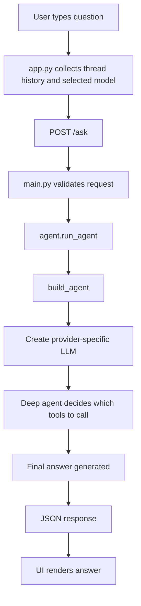

# Flow And Architecture

## High-Level Architecture

This project has 4 major layers:

1. Frontend UI
2. Backend API
3. Agent and tools layer
4. Data and document layer

## Architecture Diagram

## Flow 1: Asking A Claim Question

When a user asks something like:

> "Why was claim CLM-2024-0002 denied?"

the flow looks like this:

## Flow 2: Uploading A Policy Document

When a user uploads a policy file:

## What Each Layer Does

### 1. Frontend Layer

File:

- `app.py`

Responsibilities:

- show the chat interface
- show uploaded documents
- let the user select a model
- send requests to the backend
- display answers and sources

Analogy:

The frontend is like the reception desk in a hospital. It does not make insurance decisions. It just helps the user talk to the right system.

### 2. Backend API Layer

File:

- `main.py`

Responsibilities:

- define API routes
- accept uploads
- return model options
- call the agent
- return answers to the UI

Important routes:

- `GET /health`
- `GET /models`
- `GET /files`
- `POST /upload`
- `DELETE /files/{file_id}`
- `POST /ask`

Analogy:

The API is like a receptionist who knows where to send each request.

### 3. Agent Layer

File:

- `agent.py`

Responsibilities:

- configure available models
- choose the correct LLM provider
- define tools
- build the deep agent
- run the final reasoning flow

Important tools:

- `claim_lookup`
  - reads claim details from local claim data

- `policy_rag`
  - searches uploaded policy chunks

- `internet_search`
  - searches current public web information

Analogy:

The agent is like a senior support analyst who knows when to:

- open the claim file
- search the policy binder
- quickly check a government website

### 4. Retrieval Layer

File:

- `rag.py`

Responsibilities:

- read PDFs and DOCX files
- extract text
- chunk text
- store chunks in ChromaDB
- query chunks later

Analogy:

This is like taking a huge textbook, breaking it into sticky notes, and then quickly finding the sticky notes that best match a question.

## Data Flow In Simple Words

The system handles two kinds of data:

### Structured Data

Examples:

- claim ID
- customer name
- status
- amount approved
- appeal deadline

This comes from claim records in `data.py`.

### Unstructured Data

Examples:

- policy PDFs
- word documents
- plain text files

This comes from uploaded documents and is handled by the RAG system.

## Why RAG Is Needed

Large language models are smart, but they do not automatically know your uploaded policy file.

So the app does this:

1. reads the file
2. breaks it into chunks
3. stores those chunks
4. retrieves the best chunks at question time
5. gives those chunks to the model

That pattern is called RAG:

- Retrieval Augmented Generation

Simple analogy:

RAG is like open-book exam mode.

Without RAG, the model answers from memory.
With RAG, the model is allowed to look at the right page before answering.

## How Model Selection Works

The backend keeps a list of provider-backed models.

Today that includes:

- Groq
- Google Gemini
- NVIDIA

The UI asks `/models` for the list and shows it in a dropdown.

When the user sends a question, the selected `model_id` is sent to `/ask`.

Then `agent.py` builds the matching LangChain chat model.

## Typical Request Lifecycle

## Things A Junior Developer Should Notice

### Not Everything Is Stored In A Database

Right now:

- uploaded document vectors go to ChromaDB
- file metadata is kept in in-memory `FILES_STORE`
- claim data is seeded from local files

This is good enough for a prototype, but not ideal for production.

### Some Errors Come From Environment Setup

Examples:

- missing API keys
- package version conflicts
- backend process not restarted after `.env` changes

This is very normal in AI projects.

### The Agent Is Powerful But Still Just Code

Even though it feels "intelligent," it still depends on:

- the tools you define
- the prompts you give it
- the data it can access
- the model you selected

Bad inputs or missing tools lead to bad outputs.

