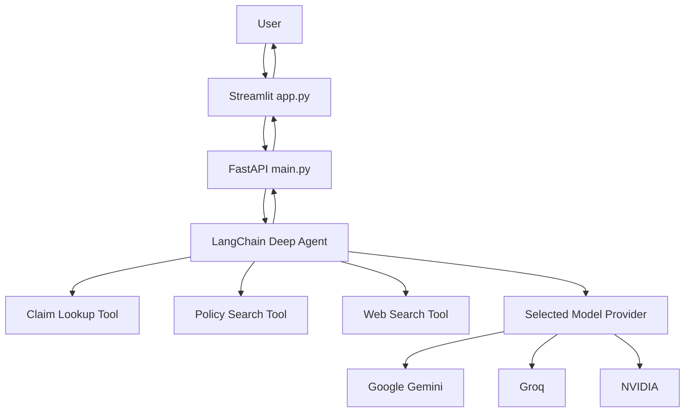

# How To Run This App

This file is for a junior developer who is new to Python, FastAPI, Streamlit, and AI apps.

If you feel confused, that is normal.
Follow the steps in order.

## What You Are Running

This project has 2 main parts:

1. Backend API
   - file: `main.py`
   - job: handles uploads, model list, and AI answers

2. Frontend UI
   - file: `app.py`
   - job: shows the chat screen in the browser

You need both parts running.

## Easy Analogy

Think of the app like a restaurant:

- `app.py` is the waiter taking the order
- `main.py` is the kitchen processing the order
- the AI model is the chef
- the documents are the ingredients

If only the waiter is working and the kitchen is closed, the app cannot answer.
If only the kitchen is running and the waiter is missing, the user cannot interact.

## Before You Start

Make sure you are inside this folder:

```powershell
cd C:\Hackthon\healthproject
```

## Files You Should Know

- `.env`
  - stores API keys and config

- `requirements.txt`
  - stores Python packages needed by the project

- `main.py`
  - backend server

- `app.py`
  - Streamlit UI

## Step 1: Check The Virtual Environment

This project uses a Python virtual environment.

In this machine, it is usually:

```powershell
C:\Hackthon\.venv
```

If it exists, use its Python directly.

Test it:

```powershell
C:\Hackthon\.venv\Scripts\python.exe --version
```

If that works, good.

## Step 2: Install Requirements

If packages are missing, install them:

```powershell
uv pip install -r requirements.txt --python C:\Hackthon\.venv\Scripts\python.exe
```

If `uv` is not available, ask the team before changing the setup.

## Step 3: Check `.env`

Open `.env` and confirm values exist.

Example:

```env
GROQ_API_KEY="your_groq_key"
GOOGLE_API_KEY="your_google_key"
NVIDIA_API_KEY="your_nvidia_key"
NVIDIA_BASE_URL="http://localhost:8099/v1"
TAVILY_API_KEY="your_tavily_key"
CHROMA_PERSIST_DIR=./chroma_db
API_BASE_URL=http://127.0.0.1:8000
```

Important:

- after changing `.env`, restart the backend
- many config changes do not apply until the Python process starts again

## Step 4: Start The Backend

Run this in PowerShell:

```powershell
cd C:\Hackthon\healthproject
C:\Hackthon\.venv\Scripts\python.exe main.py
```

What this does:

- starts FastAPI
- loads `.env`
- exposes the API on port `8000`

If it works, the backend should be available at:

```text
http://127.0.0.1:8000
```

Health check:

```text
http://127.0.0.1:8000/health
```

Expected response:

```json
{"status":"ok"}
```

Keep this terminal open.

## Step 5: Start The Frontend

Open a second PowerShell window and run:

```powershell
cd C:\Hackthon\healthproject
C:\Hackthon\.venv\Scripts\python.exe -m streamlit run app.py --server.address 127.0.0.1 --server.port 8501
```

If it works, open:

```text
http://127.0.0.1:8501
```

Keep this terminal open too.

## Step 6: Use The App

Once both are running:

1. open the browser
2. go to `http://127.0.0.1:8501`
3. choose a model from the sidebar
4. ask a sample question such as:

```text
Why was claim CLM-2024-0007 denied and can I appeal?
```

You can also:

- upload policy documents
- switch models
- ask follow-up questions

## Which URL Does What

- `http://127.0.0.1:8501`
  - Streamlit UI

- `http://127.0.0.1:8000/health`
  - backend status check

- `http://127.0.0.1:8000/models`
  - model list returned by backend

## Quick Startup Checklist

Before saying "app is broken", check these 5 things:

1. are you inside `C:\Hackthon\healthproject`?
2. is the backend terminal still running?
3. is the Streamlit terminal still running?
4. does `.env` contain the needed API keys?
5. did you restart after editing `.env`?

## Most Common Problems

## Problem: UI opens, but answers fail

Usually means:

- backend is not running
- backend crashed
- wrong API key
- model provider package missing

Check:

```text
http://127.0.0.1:8000/health
```

If that page does not work, fix the backend first.

## Problem: Gemini says API key is missing

Check `.env`:

```env
GOOGLE_API_KEY="your_real_key_here"
```

Then restart `main.py`.

Important:

- editing `.env` alone is not enough
- restart the backend after every key change

## Problem: NVIDIA model does not work

Check:

- `NVIDIA_API_KEY` exists in `.env`
- `NVIDIA_BASE_URL` is correct
- local NVIDIA service is actually running on that URL
- package is installed:

```powershell
uv pip install -r requirements.txt --python C:\Hackthon\.venv\Scripts\python.exe
```

## Problem: Groq model does not work

Check `.env`:

```env
GROQ_API_KEY="your_real_key_here"
```

## Problem: Web search does not work

Check `.env`:

```env
TAVILY_API_KEY="your_real_key_here"
```

## Problem: Upload fails

Possible reasons:

- backend is down
- file format not supported
- missing dependency

Supported types in this app:

- PDF
- DOCX
- TXT
- MD

## Problem: Port Already In Use

If port `8000` or `8501` is already busy, an old process may still be running.

You can inspect ports:

```powershell
netstat -ano | Select-String ':8000|:8501'
```

If needed, stop the process by PID:

```powershell
Stop-Process -Id <PID> -Force
```

Only do this if you are sure the process belongs to this project.

## Safe Restart Process

If things get weird, use this order:

1. stop Streamlit
2. stop backend
3. confirm ports are free
4. start backend again
5. start Streamlit again

## Recommended Daily Run Commands

Backend:

```powershell
cd C:\Hackthon\healthproject
C:\Hackthon\.venv\Scripts\python.exe main.py
```

Frontend:

```powershell
cd C:\Hackthon\healthproject
C:\Hackthon\.venv\Scripts\python.exe -m streamlit run app.py --server.address 127.0.0.1 --server.port 8501
```

## How The App Flow Works

Simple version:

1. user types a question in Streamlit
2. Streamlit sends the question to FastAPI
3. FastAPI calls the agent
4. the agent may:
   - look up claim data
   - search uploaded documents
   - search the web
5. selected AI model writes the answer
6. answer returns to the UI

## Mermaid Diagram



## Best Advice For A Junior Developer

Do not try to debug everything at once.

Debug in this order:

1. is the backend alive?
2. is the UI alive?
3. is the correct API key in `.env`?
4. did you restart after changing `.env`?
5. which exact error message do you see?

That order solves a lot of problems faster.

## Final Reminder

When in doubt:

- start backend first
- start frontend second
- test `/health`
- test the UI
- restart after `.env` changes

That simple habit will save you a lot of time.
